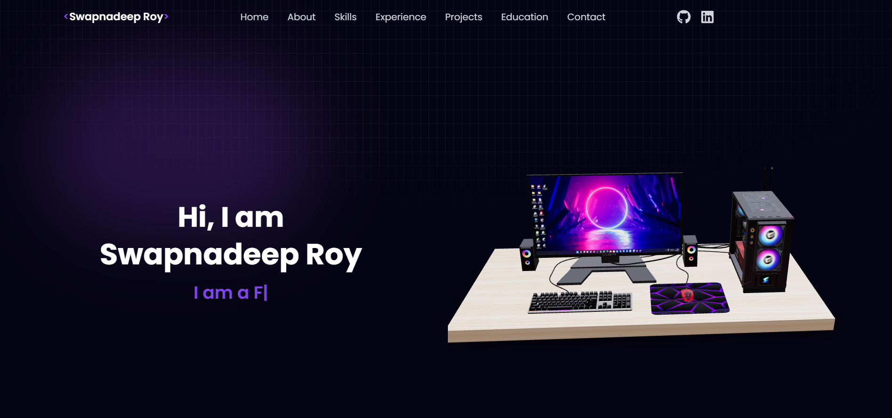

# 🌐 Personal Portfolio Website

This is my **personal portfolio website** built with **React** and **Tailwind CSS**.  
It showcases my **skills, education, work experience, and projects** in a clean and modern UI.  

---

## ✨ Features
- 🎨 **Modern UI/UX** with Tailwind CSS  
- 📱 **Fully Responsive** – works on all devices  
- ⚡ **Fast Performance** with React  
- 🧩 **Reusable Components** (About, Skills, Work, Experience, Education, Contact, Footer)  
- 🚀 **Deployed on Vercel**  

---

## 🔗 Demo  
🚀 **Live Demo:** [portfolio-sage-rho-21.vercel.app](https://portfolio-sage-rho-21.vercel.app/)  

---

## 📸 Preview  
Here’s a preview of my portfolio website:  

  

---

## 🛠️ Tech Stack
- **Frontend:** React, JSX  
- **Styling:** Tailwind CSS  
- **Deployment:** Vercel  

---

## 📂 Folder Structure
```bash
portfolio/
├── public/
├── src/
│   ├── assets/          # Images & icons
│   │   └── Preview.png  # Website preview screenshot
│   ├── components/      # Reusable components
│   │   ├── About/
│   │   ├── Contact/
│   │   ├── Education/
│   │   ├── Experience/
│   │   ├── Footer/
│   │   ├── Hero/
│   │   ├── Navbar/
│   │   ├── Skills/
│   │   └── Work/
│   ├── App.jsx
│   ├── index.css
│   ├── main.jsx
├── package.json
├── tailwind.config.js
└── README.md

---

## ⚙️ Installation & Setup
Clone the repository and install dependencies:

```bash
# Clone the repo
git clone https://github.com/swapnadeepcom/portfolio.git

# Navigate into the folder
cd portfolio

# Install dependencies
npm install

# Start development server
npm run dev

Your app will be running at http://localhost:5173/ (if using Vite).

---

## 🚀 Deployment
This project is live on **Vercel**:  
👉 [portfolio-sage-rho-21.vercel.app](https://portfolio-sage-rho-21.vercel.app/)  

---

## 👤 Author
**Swapnadeep Roy**  
- 🌎 Portfolio: [Swapnadeep Roy](https://portfolio-sage-rho-21.vercel.app/)  
- 💼 LinkedIn: [swapnadeeproy](https://www.linkedin.com/in/swapnadeeproy/)  
- 🐙 GitHub: [swapnadeepcom](https://github.com/swapnadeepcom)
